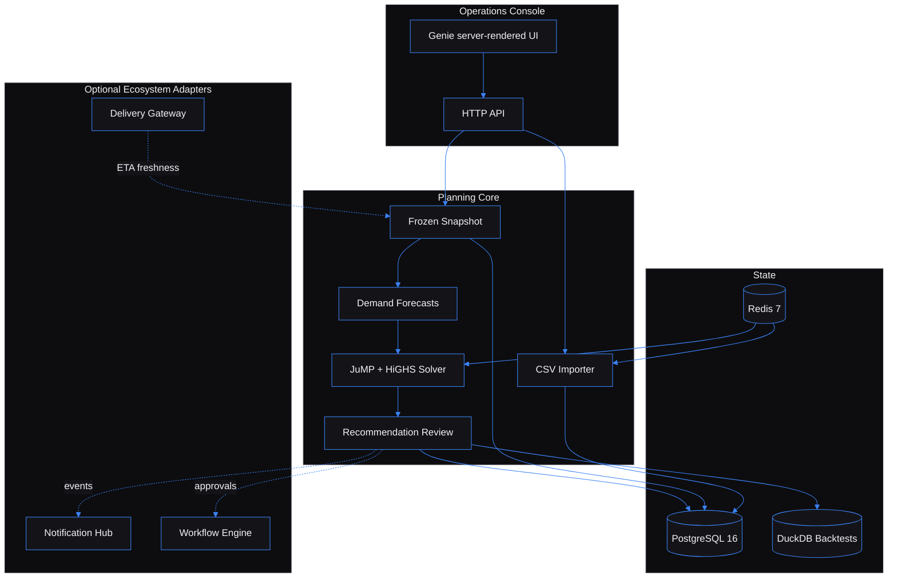

# Inventory Allocation Simulator — explainable stock allocation before demand arrives

Built by [Kingsley Onoh](https://kingsleyonoh.com) · Systems Architect

## The Problem

Distributors and retailers need to decide where scarce inventory should sit before demand arrives, not after a stockout has already happened. Inventory Allocation Simulator imports warehouse, SKU, inventory, demand, lane, and policy data; runs probabilistic demand scenarios; solves constrained transfers; and explains why each recommendation exists. The reference success target is a 50-warehouse, 2,000-SKU, 100-scenario simulation under 10 minutes p95 on the Docker Compose profile.

## Architecture



## Key Decisions

- I chose Julia with Genie over splitting the solver into a separate Python service because the web layer and the numerical model can share one type system and one deployment artifact.
- I chose JuMP with HiGHS over a black-box optimizer because planners need binding constraints, infeasibility messages, and reproducible solver output.
- I chose frozen simulation snapshots over rereading live planning tables because a completed run must remain auditable after warehouses, lanes, or SKU economics change.
- I chose CSV/manual operation as the core path over mandatory ecosystem adapters because the simulator must work when Notification Hub, Workflow Engine, and Delivery Gateway are disabled.
- I chose local notification rows plus an outbox mirror over direct-only external delivery because adapter failure should never change recommendation truth.

## Setup

### Prerequisites

- Julia 1.11+
- PostgreSQL 16
- Redis 7
- Docker Compose, if you want local infrastructure from `docker-compose.yml`
- Node.js 20+, only for Playwright E2E tests

### Installation

```bash
git clone https://github.com/kingsleyonoh/inventory-allocation-simulator.git
cd inventory-allocation-simulator
julia --project -e 'using Pkg; Pkg.instantiate()'
```

### Environment

```bash
cp .env.example .env
```

| Variable | What it controls |
|---|---|
| `APP_ENV` | Runtime mode, usually `development` or `production`. |
| `APP_HOST` | Bind address for Genie. |
| `APP_PORT` | HTTP port; defaults to `8000`. |
| `PUBLIC_DOMAIN` | Public host used by the Caddy production config. |
| `PUBLIC_BASE_URL` | Base URL used in generated links and app config. |
| `LOG_LEVEL` | Application log level. |
| `GENIE_LOG_REQUESTS` | Enables Genie request logging. |
| `POSTGRES_DB` | Local PostgreSQL database name. |
| `POSTGRES_USER` | Local PostgreSQL username. |
| `POSTGRES_PASSWORD` | Local PostgreSQL password. |
| `POSTGRES_PORT` | Local PostgreSQL port. |
| `DATABASE_URL` | PostgreSQL connection string. |
| `REDIS_PORT` | Local Redis port. |
| `REDIS_URL` | Redis URL for workers/cache coordination. |
| `DUCKDB_PATH` | DuckDB file for backtest evidence. |
| `SELF_REGISTRATION_ENABLED` | Allows or disables `POST /api/tenants/register`. |
| `API_KEY_PREFIX` | Prefix used when generating tenant API keys. |
| `DEFAULT_TENANT_NAME` | Tenant name used by first-run setup. |
| `DEFAULT_ADMIN_EMAIL` | Admin email used by first-run setup. |
| `SESSION_SECRET` | Secret used to sign UI session cookies. |
| `MAX_IMPORT_MB` | CSV upload size cap. |
| `IMPORT_PARTIAL_COMMIT` | Allows valid CSV rows to commit when other rows fail validation. |
| `UPLOAD_STORAGE_PATH` | Local path for preserved upload artifacts. |
| `DEFAULT_SCENARIO_COUNT` | Default number of demand scenarios. |
| `MIN_HISTORY_PERIODS` | Minimum demand history required for forecasting. |
| `FORECAST_LOOKBACK_DAYS` | Demand-history lookback window. |
| `SOLVER_TIMEOUT_SECONDS` | HiGHS/JuMP solver timeout. |
| `MAX_SOLVER_GAP` | Accepted solver gap. |
| `MIN_TRANSFER_UNITS` | Minimum transfer size in recommendations. |
| `RUN_STALE_AFTER_MINUTES` | Timeout for stale running simulations. |
| `SIMULATION_IDEMPOTENCY_WINDOW_HOURS` | Idempotency window for simulation creation. |
| `RECOMMENDATION_EXPIRY_DAYS` | Age window before proposed recommendations expire. |
| `REQUIRE_REJECTION_REASON` | Requires a reason on recommendation rejection. |
| `NOTIFICATION_HUB_ENABLED` | Enables outbound Notification Hub mirroring. |
| `NOTIFICATION_HUB_URL` | Notification Hub base URL. |
| `NOTIFICATION_HUB_API_KEY` | API key for Notification Hub. |
| `WORKFLOW_ENGINE_ENABLED` | Enables Workflow Engine approval triggers. |
| `WORKFLOW_ENGINE_URL` | Workflow Engine base URL. |
| `WORKFLOW_ENGINE_API_KEY` | API key for Workflow Engine. |
| `WORKFLOW_ALLOCATION_APPROVAL_WORKFLOW_ID` | Workflow ID used for allocation approvals. |
| `DELIVERY_GATEWAY_ENABLED` | Enables Delivery Gateway freshness checks. |
| `DELIVERY_GATEWAY_URL` | Delivery Gateway base URL. |
| `DELIVERY_GATEWAY_API_KEY` | API key for Delivery Gateway. |
| `DELIVERY_REDIS_URL` | Redis stream URL for delivery freshness events. |
| `SENTRY_DSN` | Optional Sentry-compatible error sink. |
| `METRICS_TOKEN` | Bearer-style internal token required by `/metrics`. |
| `POSTHOG_ENABLED` | Enables optional PostHog analytics. |
| `POSTHOG_URL` | PostHog endpoint. |
| `POSTHOG_API_KEY` | PostHog API key. |
| `DEMO_MODE` | Enables demo-mode defaults used by local setup flows. |

### Run

```bash
docker compose up -d postgres redis
julia --project scripts/migrate.jl up
julia --project scripts/setup.jl
julia --project scripts/seed_demo.jl
julia --project src/Main.jl
```

The console runs at `http://localhost:8000`. Use the tenant API key printed by setup with an active user email to sign in at `/login`.

## How It Works

```text
1. Create a tenant and API key with scripts/setup.jl or POST /api/tenants/register.
2. Import warehouses, SKUs, inventory, demand history, and transfer lanes from CSV or API.
3. Define an allocation policy: objective, service target, horizon, transfer-cost cap, region rule.
4. Start a simulation. The app freezes the current planning data into a run snapshot.
5. Workers generate demand scenarios, solve constrained transfers, and store recommendations.
6. Planners review the explanation: constraints, scenario sensitivity, net value, confidence.
7. Approved recommendations can be exported as CSV and optionally mirrored to Workflow Engine.
```

## Usage

This project is both a web operations console and an API-backed planning service. The fastest path is the console; the API examples below show the same shipped flow for automation.

### Console flow

1. Sign in at `http://localhost:8000/login` with a tenant API key and active user email.
2. Open `/imports` and upload CSVs for warehouses, SKUs, inventory, demand history, and lanes. Row-level validation errors are shown in the Import Center.
3. Open `/policies` and create an allocation policy with objective, service target, horizon, and transfer constraints.
4. Open `/simulations` and start a run. The run detail page shows scenario summaries, solver diagnostics, and recommendations.
5. Open a recommendation detail page to approve, reject, or export a transfer plan.
6. Use `/notifications` and `/integrations` to inspect local alerts and optional adapter health.

### API happy path

All protected API calls use tenant resolution from `X-API-Key`.

```bash
API=http://localhost:8000
KEY=ias_live_your_key_here
```

Create or inspect tenant identity:

```bash
curl -s "$API/tenants/me" \
  -H "X-API-Key: $KEY"
```

Create a warehouse and SKU:

```bash
curl -s -X POST "$API/api/warehouses" \
  -H "X-API-Key: $KEY" -H "Content-Type: application/json" \
  -d '{"code":"BRI","name":"Bristol DC","region":"GB-SW","capacity_units":10000}'

curl -s -X POST "$API/api/skus" \
  -H "X-API-Key: $KEY" -H "Content-Type: application/json" \
  -d '{"sku_code":"SKU-RED","name":"Red Widget","category":"widgets","unit_margin_cents":600,"stockout_cost_cents":1200,"holding_cost_cents":40}'
```

Upload planning data as CSV:

```bash
curl -s -X POST "$API/api/imports" \
  -H "X-API-Key: $KEY" \
  -F "import_type=inventory" \
  -F "file=@tests/fixtures/csv/inventory.csv"
```

Create a simulation run:

```bash
curl -s -X POST "$API/api/simulations" \
  -H "X-API-Key: $KEY" -H "Content-Type: application/json" \
  -H "Idempotency-Key: demo-run-001" \
  -d '{"policy_id":"POLICY_UUID","name":"Morning allocation","scenario_count":100}'
```

Review and decide a recommendation:

```bash
curl -s "$API/api/recommendations/RECOMMENDATION_UUID" \
  -H "X-API-Key: $KEY"

curl -s -X POST "$API/api/recommendations/RECOMMENDATION_UUID/approve" \
  -H "X-API-Key: $KEY" -H "Content-Type: application/json" \
  -d '{"reason":"Planner accepted high net value transfer"}'

curl -L -o recommendation.csv "$API/api/recommendations/RECOMMENDATION_UUID/export.csv" \
  -H "X-API-Key: $KEY"
```

### What it handles

| Concern | Built behavior |
|---|---|
| Tenant isolation | Every API, UI, job, and export path resolves tenant context before data access. |
| CSV errors | Import jobs preserve upload artifacts and row-level errors for retry. |
| Forecast bias | Stockout periods increase uncertainty instead of being treated as true low demand. |
| Solver transparency | Runs store constraint reports, infeasible/timeout failures, confidence, and net-value drivers. |
| Recommendation truth | Approval/rejection/export decisions are audited and do not depend on optional adapters. |
| Adapter failures | Notification Hub, Workflow Engine, and Delivery Gateway are feature-flagged and fail without blocking core planning. |

### Endpoint reference

| Area | Routes |
|---|---|
| Tenant and users | `POST /api/tenants/register`, `GET /tenants/me`, `GET /api/users`, `POST /api/users`, `PATCH /api/users/:id` |
| Catalog | `GET/POST /api/warehouses`, `GET/PATCH/DELETE /api/warehouses/:id`, `GET/POST /api/skus`, `GET/PATCH/DELETE /api/skus/:id` |
| Planning data | `GET /api/inventory`, `PUT /api/inventory/:id`, `GET /api/demand-history`, `GET/POST /api/lanes`, `GET/POST /api/policies` |
| Imports | `POST /api/imports`, `GET /api/imports/:id` |
| Simulations | `POST /api/simulations`, `GET /api/simulations`, `GET /api/simulations/:id`, `POST /api/simulations/:id/cancel` |
| Recommendations | `GET /api/recommendations`, `GET /api/recommendations/:id`, `POST /api/recommendations/:id/approve`, `POST /api/recommendations/:id/reject`, `POST /api/recommendations/:id/expire`, `POST /api/recommendations/:id/export`, `GET /api/recommendations/:id/export.csv` |
| Notifications and integrations | `GET /api/notifications`, `PATCH /api/notifications/:id/read`, `GET /api/integrations/status`, `POST /api/integrations/test` |
| Operations | `GET /health`, `GET /health/db`, `GET /health/ready`, `GET /metrics` |

## Tests

```bash
julia --project -e 'using Pkg; Pkg.test()'
julia --project -e 'using Aqua, InventoryAllocationSimulator; Aqua.test_all(InventoryAllocationSimulator; stale_deps=false)'
npx playwright test
bash scripts/scan-secrets.sh
```

## AI Integration

This project includes machine-readable context for AI tools:

| File | What it does |
|------|-------------|
| [`llms.txt`](llms.txt) | Project summary for LLMs ([llmstxt.org](https://llmstxt.org)) |
| [`AGENTS.md`](AGENTS.md) | Full codebase instructions for AI coding agents |
| [`openapi.yaml`](openapi.yaml) | OpenAPI 3.1 API specification |
| [`mcp.json`](mcp.json) | MCP server definition for AI IDEs |

### Cursor / Other AI IDEs

Point your AI agent at `AGENTS.md` for full codebase context.

## Deployment

This project runs as a Docker Compose stack with the app behind Caddy. The published image is `ghcr.io/kingsleyonoh/inventory-allocation-simulator:latest`.

### Production Stack

| Component | Role |
|-----------|------|
| `migrate` | Runs PostgreSQL migrations before the app starts. |
| `app` | Genie HTTP server and planning API. |
| `caddy` | HTTPS reverse proxy using `PUBLIC_DOMAIN`. |
| `postgres` | PostgreSQL 16 tenant and planning data store. |
| `redis` | Redis 7 worker/cache coordination. |
| `app-data` volume | Upload artifacts and DuckDB backtest file. |

### Self-Host

```bash
# Pull the image
docker pull ghcr.io/kingsleyonoh/inventory-allocation-simulator:latest

# Or use the compose file
docker compose -f docker-compose.prod.yml up -d
```

Set the environment variables listed in **Setup > Environment** before starting.

---

Full case study, architectural breakdown, and engineering deep-dive at [kingsleyonoh.com/projects/inventory-allocation-simulator](https://www.kingsleyonoh.com/projects/inventory-allocation-simulator)
